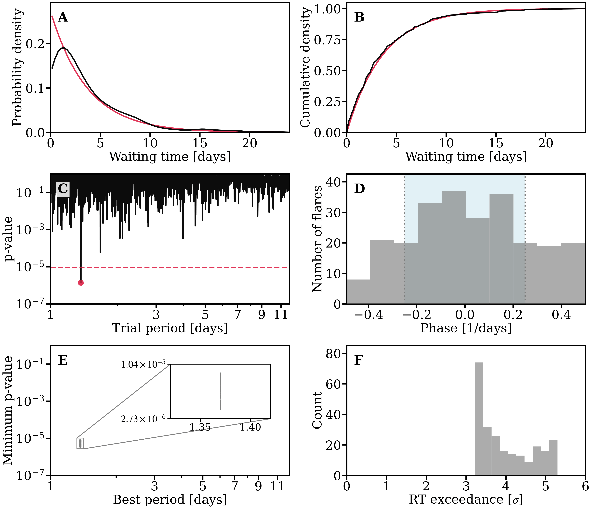

<p align="center">
  
</p>

# SELAS

**Stellar Emission Lightcurve Analyzing System**

Python pipeline for TESS light curves that downloads or loads target data, detrends stellar light curves, identifies flare candidates, and searches the resulting flare times for waiting-time and periodicity structure.

SELAS is organized as a modular analysis workflow for TIC targets. The main runner estimates stellar rotation, retrieves TIC properties, detrends the light curve, runs a two-pass flare finder, computes waiting-time statistics, performs a Rayleigh periodicity search, and optionally applies a jackknife test when the Rayleigh exceedance is positive.

## Full pipeline plot



The original vector version is included at [`Assets/full_pipeline_image.pdf`](Assets/full_pipeline_image.pdf).

## Layout

```text
SELAS/                         # git repo root
├── requirements.txt            # Python dependencies
├── LICENSE                     # MIT license
├── README.md
├── README.txt
├── Assets/
│   ├── Logo.png                # SELAS logo
│   ├── full_pipeline_image.pdf # original full-pipeline figure
│   └── full_pipeline_image.png # README-friendly rendered figure
├── Notebooks/
│   ├── Run_SELAS_single_TIC.ipynb       # Runs the pipeline for TIC ids 
│   └── Flare_Distribution_Model.ipynb   # Generates planet-induced flare arrival times
└── Selas/                      # source modules used by notebooks and runner
    ├── selas_runner.py         # full TIC pipeline runner
    ├── lightcurve_detrender.py # TESS light-curve detrending
    ├── flare_finder.py         # reusable two-pass flare finder
    ├── waiting_time_statistics.py
    ├── periodicity_statistics.py
    └── jackknife_test.py
```

## Install

Clone your repository and install the dependencies into a clean Python environment.

```bash
git clone https://github.com/CHindriks/Selas SELAS
cd SELAS

python3 -m venv .venv
python3 -m pip install -r requirements.txt
```

SELAS currently uses the `Selas/` source folder directly from notebooks and scripts. If you later add a `pyproject.toml`, you can also make the project installable with `pip install -e .`.

## To run the single-target notebook

```python
python -m notebook Notebooks/Run_SELAS_single_TIC.ipynb
```

In the notebook, set:

```python
TIC_ID = "383615666"  # change this to the TIC target you want to analyze
MAKE_PLOTS = True
```

Then run the pipeline cell. SELAS writes outputs under:

```text
Data/Selas-TIC-ids/<TIC_ID>/Data/
```

Typical outputs include the detrended light curve, flare table, stellar rotation table, TIC star properties, waiting-time summaries, periodicity summaries, a run log, and the full-pipeline diagnostic plot when the required stages complete successfully.

## Quick start with your own TIC ID

```python
from pathlib import Path
import sys

SELAS_PATH = Path("Selas").resolve()
DATA_ROOT = Path("Data/Selas-TIC-ids")

if str(SELAS_PATH) not in sys.path:
    sys.path.insert(0, str(SELAS_PATH))

from selas_runner import run_single_tic_pipeline

result = run_single_tic_pipeline(
    tic_id="383615666",
    data_root=DATA_ROOT,
    selas_path=SELAS_PATH,
    make_plots=True,
    capture_log=True,
    display_dataframes=True,
    raise_on_error=True,
)

print("Run status:", result.get("status"))
print("Log file:", result.get("log_path"))
print("Output folder:", result.get("data_path"))
```

To run multiple targets:

```python
from selas_runner import load_tic_ids_from_file, run_many_tic_pipelines

tic_ids = load_tic_ids_from_file("[your_list].txt")
results = run_many_tic_pipelines(
    tic_ids,
    data_root=DATA_ROOT,
    selas_path=SELAS_PATH,
    make_plots=False,
    display_dataframes=False,
    raise_on_error=False,
)
```

## Pipeline stages

1. **Stellar rotation** - downloads TESS SPOC 120 s light curves with `lightkurve`, estimates per-sector Lomb-Scargle rotation periods, and saves a representative stellar rotation period.
2. **TIC star properties** - queries the TIC catalog with `astroquery.mast.Catalogs` and saves selected stellar parameters.
3. **Light-curve detrending** - prepares TESS light curves, fits segmented polynomial baselines, removes sinusoidal residual structure when enabled, and exports detrended time series.
4. **Two-pass flare finding** - searches detrended residuals for flare candidates, merges/filters events, handles multi-peak flares, and writes a final flare table.
5. **Waiting-time statistics** - computes PDF/CDF waiting-time diagnostics, accounts for observing gaps, and runs Kolmogorov-Smirnov comparisons to an exponential waiting-time model.
6. **Rayleigh periodicity search** - searches flare times across a period grid and reports the strongest candidate periods and p-values.
7. **Jackknife robustness test** - when the Rayleigh exceedance is positive, leaves out flares one at a time to test whether the signal is driven by a small number of events.
8. **Full-pipeline figure** - combines the waiting-time, periodicity, phase, and jackknife diagnostics into a single summary plot.

## System requirements

### Hardware requirements

SELAS runs on a standard workstation or laptop for typical TIC-target analyses. Memory requirements depend mainly on the number and size of TESS light curves loaded for a target and on whether plots and simulations are enabled.

### Software requirements

SELAS has no intentional OS-specific code and should run on Linux, macOS, or Windows when the dependencies install successfully. Internet access is needed for stages that query MAST/TIC data through `lightkurve` and `astroquery`, unless the necessary data are already cached or supplied locally.

Python dependencies are listed in `requirements.txt`:

```text
numpy
pandas
matplotlib
scipy
astropy
astroquery
lightkurve
tqdm
joblib
scikit-learn
jupyter
ipykernel
```

## Main configurable parameters

Most knobs live in dataclasses inside the source modules. Import a config class, override the defaults you need, and pass it to the relevant lower-level function when running modules directly.

### Full runner flags

| Parameter | Default | Meaning |
|---|---:|---|
| `tic_id` | required | TIC target ID to analyze |
| `data_root` | `../Data/Selas-TIC-ids` | Root folder where per-target outputs are written |
| `selas_path` | `../Selas` | Path to the SELAS source modules |
| `make_plots` | `False` | Save diagnostic plots where supported |
| `capture_log` | `True` | Write stdout/stderr to `<TIC_ID>_run_log.txt` |
| `display_dataframes` | `True` | Display intermediate dataframes in notebooks |
| `raise_on_error` | `True` | Raise exceptions instead of returning an error result |
| `run_rotation` | `True` | Run the stellar-rotation step |
| `run_star_properties_step` | `True` | Query and save TIC stellar properties |
| `run_detrend_flares_step` | `True` | Detrend the light curve and find flares |
| `run_waiting_time_step` | `True` | Run waiting-time statistics |
| `run_periodicity_step` | `True` | Run the Rayleigh periodicity search |
| `run_jackknife_step` | `True` | Run jackknife testing when eligible |

### `DetrendConfig`

| Field | Default | Meaning |
|---|---:|---|
| `window_sizes` | `(0.4, 0.6, 0.8)` | Segment window sizes in days for polynomial baseline fits |
| `poly_deg` | `4` | Polynomial degree for each segment fit |
| `flare_mask_sigma` | `5.0` | Initial flare-mask sigma threshold |
| `second_pass_sigma` | `3.0` | Second-pass/final flare-mask threshold |
| `rolling_window_pts` | `100` | Rolling window size for local noise estimates |
| `smooth_sigma_cadences` | `5` | Gaussian smoothing width in cadences |
| `apply_sinusoid_correction` | `True` | Remove short-period sinusoidal residuals when useful |
| `apply_rotation_sinusoid_correction` | `True` | Remove rotation-timescale sinusoidal residuals |
| `known_rotation_period_days` | `None` | Optional known stellar rotation period |
| `auto_estimate_granulation` | `False` | Automatically estimate granulation timescale |

### `FlareFinderConfig`

| Field | Default | Meaning |
|---|---:|---|
| `lower_sigma` | `1.8` | Lower residual threshold used in flare grouping |
| `moving_average_sigma` | `1.5` | Threshold for moving-average support |
| `n_consecutive_points` | `3` | Minimum consecutive points for a candidate |
| `max_below_threshold` | `4` | Allowed below-threshold points inside a candidate |
| `min_gap_distance_points` | `50` | Minimum point gap used to separate flare groups |
| `strong_flare_peak_sigma` | `5.0` | Peak threshold for strong flare masking |
| `local_noise_window_days` | `None` | Optional local noise window in days |
| `include_flux_err_in_detection_sigma` | `False` | Include flux errors in detection sigma |
| `split_multi_peak_flares` | `True` | Split complex flares into multiple peaks where appropriate |
| `multi_peak_min_peak_sigma` | `2.0` | Minimum sigma for multi-peak detection |

### `AnalysisConfig`

| Field | Default | Meaning |
|---|---:|---|
| `number_of_simulations` | `500` | Number of simulated flare sets for waiting-time analysis |
| `waiting_time_limit` | `24.0` | Maximum waiting time retained, in days |
| `gap_threshold` | `0.1` | Observing-gap threshold in days |
| `max_gap_for_simulation` | `24.0` | Largest observing gap eligible for simulated filling |
| `binsize` | `0.3` | Waiting-time histogram/PDF bin size in days |
| `pdf_smoothing_width_days` | `0.3` | PDF smoothing width in days |
| `min_flares_for_target` | `5` | Minimum flares required for the target analysis |

### `PeriodicityConfig`

| Field | Default | Meaning |
|---|---:|---|
| `min_period` | `1.0` | Minimum trial period in days |
| `max_period` | `12.0` | Maximum trial period in days |
| `phase_tol` | `0.25` | Fractional phase tolerance for period-grid spacing |
| `phase_bins` | `51` | Number of phase bins used in phase-coverage statistics |
| `prominence` | `0.25` | Peak prominence for minima detection in `-log10(p)` |
| `smooth_sigma` | `0.1` | Gaussian smoothing width for `-log10(p)` |
| `n_best` | `3` | Number of non-rotation candidate periods to report |
| `min_flares_for_rayleigh` | `5` | Minimum flares required before Rayleigh testing |
| `n_jobs` | `-1` | Parallel jobs for supported calculations |
| `save_figures` | `True` | Save periodicity diagnostic figures |
| `show_figures` | `True` | Display periodicity diagnostic figures |

See the source docstrings for the full parameter list and lower-level function options.

## Notes on data and reproducibility

- The default runner creates per-target directories automatically.
- Downloaded TESS products are cached under each target's data folder.
- Several stages depend on live catalog services unless the relevant data are cached.
- Use `capture_log=True` to keep a reproducible text record of each run.
- Use `random_seed` in `AnalysisConfig` and `PeriodicityConfig` when running lower-level analyses that include random or stochastic steps.

## Citing

SELAS is free to use and modify. If you use it in academic work, please cite the relevant SELAS thesis. ON ITS WAY.

## License

MIT

Copyright (c) 2026 Casper Hindriks

Permission is hereby granted, free of charge, to any person obtaining a copy of this software and associated documentation files (the "Software"), to deal in the Software without restriction, including without limitation the rights to use, copy, modify, merge, publish, distribute, sublicense, and/or sell copies of the Software, subject to the conditions in the included `LICENSE` file.
